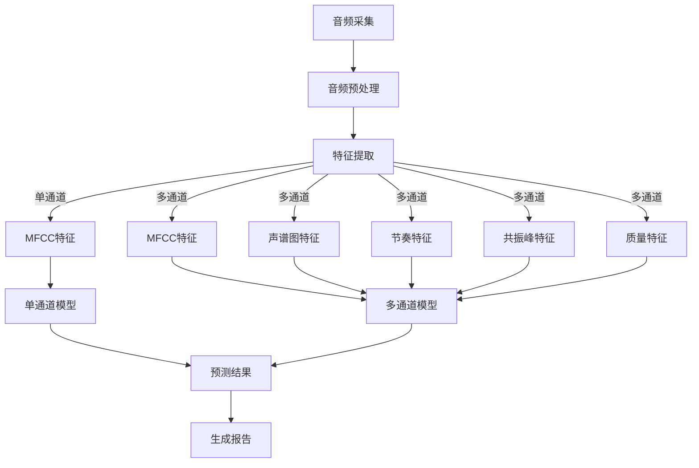

<p align="center">
  
  <br/>
  <br/>
</p>


<p align="center">
    <a href="https://github.com/HIT-JimmyXiao/Sonar-Star/blob/main/LICENSE"></a>
    <a href="https://github.com/HIT-JimmyXiao/Sonar-Star/releases"></a>
    <a href="https://pytorch.org/"></a>
    <a href="https://python.org/"></a>
</p>


<h4 align="center">
    <p>
        <b>简体中文</b> |
        <a href="https://github.com/HIT-JimmyXiao/Sonar-Star/blob/main/README_en.md">English</a>
    </p>
</h4>


## 📋 项目概述

声纳星鉴是一个基于声纹AI技术的自闭症早期筛查工具，可在儿童1-2岁时通过分析语音特征发现自闭症风险。系统使用深度学习技术分析儿童语音中的多种声学特征，实现高精度的自闭症风险预测。

可以直接访问 https://sonar.vip.cpolar.top/ 查看我们的项目展示结果

## ✨ 系统特点

- **早期筛查**：针对1-6岁儿童，实现自闭症的早期发现
- **非侵入性**：仅通过录音分析，无需复杂的临床检查
- **多通道分析**：同时分析MFCC、声谱图、短时能量、过零率、共振峰等多种声学特征
- **高精度预测**：采用先进的SE-ResNet50深度学习模型，提高预测准确率
- **易于使用**：简单的命令行界面，支持批量处理和单个音频分析

## 🔍 项目结构

```
星语自闭症早期筛查系统/
├── data/                       # 数据目录
│   ├── ASDchild1.wav           # 自闭症儿童语音样本
│   ├── ASDchild2.wav
│   ├── NormalChild_30.wav      # 正常发育儿童语音样本
│   └── ...
├── feature_extract/            # 特征提取模块
│   ├── __init__.py
│   ├── acoustic_feature.py     # 声学特征提取
│   └── basic_functions.py      # 基础功能函数
├── multi_channel/              # 多通道模型
│   ├── __init__.py
│   ├── model.py                # 多通道SE-ResNet50模型定义
│   ├── extract_features.py     # 多通道特征提取
│   ├── prepare_data.py         # 数据准备
│   ├── train.py                # 模型训练
│   └── run.py                  # 多通道流程执行
├── single_channel/             # 单通道模型
│   ├── __init__.py
│   ├── model.py                # 单通道SE-ResNet50模型定义
│   ├── extract_mfcc.py         # MFCC特征提取
│   ├── train.py                # 模型训练
│   └── run.py                  # 单通道流程执行
├── prediction/                 # 预测模块
│   ├── __init__.py
│   ├── predict_multi_channel.py # 多通道预测
│   └── predict_single_channel.py # 单通道预测
├── results/                    # 结果输出目录
│   ├── mfcc/                   # MFCC特征图像
│   ├── spectrogram/            # 声谱图特征
│   ├── rhythm/                 # 节奏特征（短时能量和过零率）
│   ├── formant/                # 共振峰特征
│   └── quality/                # 质量特征
├── model_training/             # 模型训练输出
│   ├── single_channel/         # 单通道模型训练输出
│   └── model_output/           # 模型保存目录
├── run.py                      # 主入口脚本
└── requirements.txt            # 依赖库
```

## 🔄 系统原理图



## 🚀 环境配置与使用

### 安装步骤

1. 克隆仓库

   ```bash
   git clone https://github.com/HIT-JimmyXiao/Sonar-Star.git
   ```

2. 创建虚拟环境（可选）

   ```bash
   python -m venv venv
   source venv/bin/activate  # Linux/Mac
   venv\Scripts\activate     # Windows
   ```

3. 安装依赖

   ```bash
   pip install -r requirements.txt
   ```

### 使用方法

#### 单通道模式

单通道模式仅使用MFCC特征进行分析：

```bash
# 对音频文件进行降噪处理
python audio_processing.py --audio data/ASDchild2.wav --denoise --output results

# 仅预测（使用预训练模型）
python run.py --mode single --test_audio ./data/ASDchild2.wav --skip_training --skip_data_prep
```

#### 多通道模式

多通道模式同时分析多种声学特征：

```bash
# 完整流程（数据准备、训练、预测）
python run.py --mode multi --audio_dir ./data

# 仅预测（使用预训练模型）
python run.py --mode multi --test_audio ./data/ASDchild2.wav --skip_training --skip_data_prep
```

#### 参数说明

- `--mode`：运行模式，single（单通道）或multi（多通道）
- `--audio_dir`：音频文件目录
- `--output_dir`：输出目录
- `--epochs`：训练轮数（默认50）
- `--batch_size`：批次大小（默认16）
- `--lr`：学习率（默认0.0001）
- `--test_audio`：用于测试的音频文件
- `--skip_training`：跳过训练步骤
- `--skip_data_prep`：跳过数据准备步骤

## 🔧 模型说明

### 单通道模型

1. **音频采集**：通过硬件设备或软件接口采集儿童语音
2. **音频预处理**：
   - 语音端点检测(VAD)
   - 谱减法降噪
   - 信号增强
3. **特征提取**：
   - MFCC特征
   - 声谱图
   - 短时能量
   - 过零率
   - 共振峰
4. **AI模型推理**：使用SE-ResNet50深度学习模型分析声学特征
5. **结果输出**：生成筛查报告，给出自闭症风险评估

- 输入：MFCC特征图像（224x224像素，单通道）
- 主干网络：SE-ResNet50
- 分类器：多层感知机（2048-1024-512-256-128-2）
- 输出：正常/自闭症分类结果及概率

### 多通道模型

多通道模型同样使用SE-ResNet50架构，但同时分析5种声学特征：

- 输入：5通道特征图像（MFCC、声谱图、短时能量、过零率、共振峰）
- 主干网络：SE-ResNet50（修改为5通道输入）
- 通道注意力机制：自适应调整不同特征的权重
- 分类器：增强型多层感知机（2048-1024-512-256-128-2）
- 输出：正常/自闭症分类结果及概率

## 📊 训练技巧

系统采用多种先进的训练技巧提高模型性能：

- 混合精度训练：加速训练过程
- 余弦退火学习率调度：优化学习率变化
- 权重衰减：防止过拟合
- 类别权重平衡：处理不平衡数据集
- 数据增强：提高模型泛化能力

## 📈 结果解读

预测结果包括：

- 分类结果（正常/自闭症）
- 预测概率
- 风险等级（低风险/高风险）
- 可视化特征图像
- 预测结果图表

## ⚠️ 注意事项

- 本系统仅作为筛查工具，不能替代专业医疗诊断
- 建议使用高质量录音，环境噪音较低
- 录音时长建议在30秒以上
- 系统性能与训练数据集规模和质量相关

## 📄 许可证

本项目采用MIT许可证

## 🤝 贡献

欢迎通过Issue和Pull Request形式贡献代码和提出建议。

## 📚 引用

如果您在研究中使用了本项目，请按以下格式引用：

```bibtex
@misc{policy-text-classification,
  author = {哈工大肖景铭、陈玖玖等——声纳星鉴团队},
  title = {SONAR-STAR},
  year = {2025},
  publisher = {GitHub},
  url = {https://github.com/HIT-JimmyXiao/Sonar-Star}
}
```

## 📧 联系方式

如有任何问题或建议，请通过以下方式联系我们：

- 电子邮件：xiao.jm44@qq.com
- GitHub Issues: https://github.com/HIT-JimmyXiao/Sonar-Star/issues
