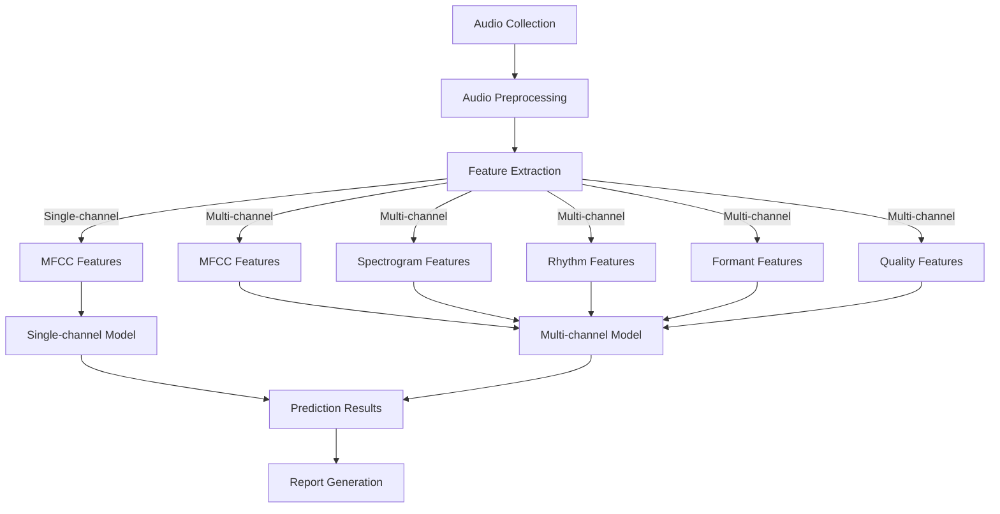

<p align="center">
  
  <br/>
  <br/>
</p>
<p align="center">
    <a href="https://github.com/HIT-JimmyXiao/Sonar-Star/blob/main/LICENSE"></a>
    <a href="https://github.com/HIT-JimmyXiao/Sonar-Star/releases"></a>
    <a href="https://pytorch.org/"></a>
    <a href="https://python.org/"></a>
</p>


<h4 align="center">
    <p>
        <a href="https://github.com/HIT-JimmyXiao/Sonar-Star/blob/main/README.md">简体中文</a> |
        <b>English</b>
    </p>
</h4>

## 📋 Project Overview

SONAR-STAR is an autism early screening tool based on voice AI technology that can detect autism risk in children aged 1-2 years by analyzing speech features. The system uses deep learning technology to analyze multiple acoustic features in children's speech, achieving high-precision autism risk prediction.

Visit https://sonar.vip.cpolar.top/ to see our project demonstration results.

## ✨ System Features

- **Early Screening**: Enables early detection of autism in children aged 1-6 years
- **Non-invasive**: Only requires audio recording analysis, no complex clinical examinations
- **Multi-channel Analysis**: Simultaneously analyzes multiple acoustic features including MFCC, spectrogram, short-time energy, zero-crossing rate, and formants
- **High-precision Prediction**: Uses advanced SE-ResNet50 deep learning model to improve prediction accuracy
- **Easy to Use**: Simple command-line interface, supports batch processing and single audio analysis

## 🔍 Project Structure

```
SONAR-STAR/
├── data/                       # Data directory
│   ├── ASDchild1.wav           # Autism spectrum disorder child voice samples
│   ├── ASDchild2.wav
│   ├── NormalChild_30.wav      # Normal development child voice samples
│   └── ...
├── feature_extract/            # Feature extraction module
│   ├── __init__.py
│   ├── acoustic_feature.py     # Acoustic feature extraction
│   └── basic_functions.py      # Basic functions
├── multi_channel/              # Multi-channel model
│   ├── __init__.py
│   ├── model.py                # Multi-channel SE-ResNet50 model definition
│   ├── extract_features.py     # Multi-channel feature extraction
│   ├── prepare_data.py         # Data preparation
│   ├── train.py                # Model training
│   └── run.py                  # Multi-channel process execution
├── single_channel/             # Single-channel model
│   ├── __init__.py
│   ├── model.py                # Single-channel SE-ResNet50 model definition
│   ├── extract_mfcc.py         # MFCC feature extraction
│   ├── train.py                # Model training
│   └── run.py                  # Single-channel process execution
├── prediction/                 # Prediction module
│   ├── __init__.py
│   ├── predict_multi_channel.py # Multi-channel prediction
│   └── predict_single_channel.py # Single-channel prediction
├── results/                    # Results output directory
│   ├── mfcc/                   # MFCC feature images
│   ├── spectrogram/            # Spectrogram features
│   ├── rhythm/                 # Rhythm features (short-time energy and zero-crossing rate)
│   ├── formant/                # Formant features
│   └── quality/                # Quality features
├── model_training/             # Model training output
│   ├── single_channel/         # Single-channel model training output
│   └── model_output/           # Model save directory
├── run.py                      # Main entry script
└── requirements.txt            # Dependencies
```

## 🔄 System Architecture Diagram



## 🚀 Setup and Usage

### Installation Steps

1. Clone the repository
   ```bash
   git clone https://github.com/HIT-JimmyXiao/Sonar-Star.git
   ```

2. Create a virtual environment (optional)
   ```bash
   python -m venv venv
   source venv/bin/activate  # Linux/Mac
   venv\Scripts\activate     # Windows
   ```

3. Install dependencies
   ```bash
   pip install -r requirements.txt
   ```

### Usage Instructions

#### Single-channel Mode

Single-channel mode only uses MFCC features for analysis:

```bash
# Process audio file with noise reduction
python audio_processing.py --audio data/ASDchild2.wav --denoise --output results

# Prediction only (using pre-trained model)
python run.py --mode single --test_audio ./data/ASDchild2.wav --skip_training --skip_data_prep
```

#### Multi-channel Mode

Multi-channel mode analyzes multiple acoustic features simultaneously:

```bash
# Complete workflow (data preparation, training, prediction)
python run.py --mode multi --audio_dir ./data

# Prediction only (using pre-trained model)
python run.py --mode multi --test_audio ./data/ASDchild2.wav --skip_training --skip_data_prep
```

#### Parameter Description

- `--mode`: Running mode, single or multi
- `--audio_dir`: Audio file directory
- `--output_dir`: Output directory
- `--epochs`: Training epochs (default 50)
- `--batch_size`: Batch size (default 16)
- `--lr`: Learning rate (default 0.0001)
- `--test_audio`: Audio file for testing
- `--skip_training`: Skip training step
- `--skip_data_prep`: Skip data preparation step

## 🔧 Model Description

### Single-channel Model

1. **Audio Collection**: Collecting children's speech through hardware devices or software interfaces
2. **Audio Preprocessing**:
   - Voice Activity Detection (VAD)
   - Spectral subtraction noise reduction
   - Signal enhancement
3. **Feature Extraction**:
   - MFCC features
   - Spectrogram
   - Short-time energy
   - Zero-crossing rate
   - Formants
4. **AI Model Inference**: Using SE-ResNet50 deep learning model to analyze acoustic features
5. **Results Output**: Generate screening report with autism risk assessment

- Input: MFCC feature image (224x224 pixels, single channel)
- Backbone network: SE-ResNet50
- Classifier: Multi-layer perceptron (2048-1024-512-256-128-2)
- Output: Normal/autism classification result and probability

### Multi-channel Model

The multi-channel model also uses the SE-ResNet50 architecture but analyzes 5 types of acoustic features simultaneously:

- Input: 5-channel feature images (MFCC, spectrogram, short-time energy, zero-crossing rate, formants)
- Backbone network: SE-ResNet50 (modified for 5-channel input)
- Channel attention mechanism: Adaptively adjusts weights of different features
- Classifier: Enhanced multi-layer perceptron (2048-1024-512-256-128-2)
- Output: Normal/autism classification result and probability

## 📊 Training Techniques

The system employs various advanced training techniques to improve model performance:

- Mixed precision training: Accelerates the training process
- Cosine annealing learning rate scheduling: Optimizes learning rate changes
- Weight decay: Prevents overfitting
- Class weight balancing: Handles imbalanced datasets
- Data augmentation: Improves model generalization ability

## 📈 Result Interpretation

Prediction results include:

- Classification result (normal/autism)
- Prediction probability
- Risk level (low risk/high risk)
- Visualized feature images
- Prediction result charts

## ⚠️ Important Notes

- This system is only a screening tool and cannot replace professional medical diagnosis
- High-quality recordings with low environmental noise are recommended
- Recording duration should be more than 30 seconds
- System performance is related to training dataset scale and quality

## 📄 License

This project is licensed under the MIT License.

## 🤝 Contributions

Contributions through Issues and Pull Requests are welcome.

## 📚 Citation

If you use this project in your research, please cite it as follows:

```bibtex
@misc{policy-text-classification,
  author = {HIT SONAR-STAR Team (Jimmy Xiao, Jiujiu Chen, et al.)},
  title = {SONAR-STAR},
  year = {2025},
  publisher = {GitHub},
  url = {https://github.com/HIT-JimmyXiao/Sonar-Star}
}
```

## 📧 Contact Information

For any questions or suggestions, please contact us through:
- Email: xiao.jm44@qq.com
- GitHub Issues: https://github.com/HIT-JimmyXiao/Sonar-Star 
